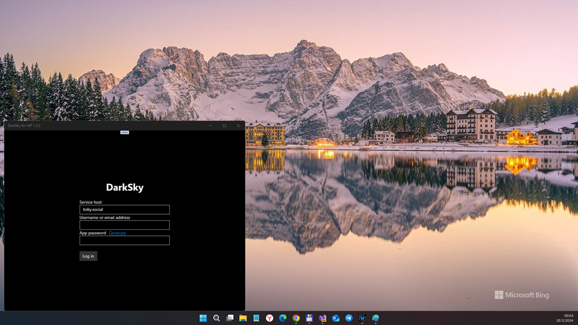
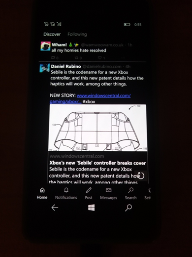

# DarkSky 1.0.4 - retro branch

Bluesky client for Windows Phone (on W10M OS)

## About / Abstract
This is BlueWP's fork re-named as DarkSky for Windows Phone (yea, I planned basing on DarkSky project too!)

## Screenshot(s)

## My 2 cents
- BlueWP project name transformed into more "modern" DarkSky name (inspired by FireCubeStudios!)
- Min. Win. OS build targeted to 14393 at now 
- Still alpha version, no less no more

## Tech/dev details
- Platforms: UWP only
- Targets: x64; x64; ARM
- OSes: Windows 10 or Windows 10 Mobile 
- Win. SDK used: 19041 
- Min. Win. OS build: 14393  

## Building
Everything should be in `DarkSky.sln`; the solution is pinned to use VS2017 so that you can deploy directly
to the device, but you should be able to compile and build packages with VS2022 (Preview) as well.

## Installation
- Enable Developer mode on your phone (Settings > Update & Security > For developers)
- Enable Device discovery and Device Portal
- Connect your phone to your WiFi and open the address provided under "Connect using:"
- In the browser, follow the instructions to pair your phone to your computer
- In the device portal's App Manager, select the `.appxbundle` file from the downloaded release
- If this is your first time installing, add the contents of the Dependencies directory using the "App dependency" button
- Press Go and wait until it installs; ensure your phone doesn't lock while it's installing.

## Todo
- Posting: Autocomplete handles
- Pagination / infinite scrolling
- Fix Cube.UI-WinSDK 14393 incompatibility and re-activate Cube.UI

## References
- https://github.com/FireCubeStudios/DarkSky/ Original DarkSky project
- https://github.com/FireCubeStudios/ FireCubeStudios, DarkSky's creators/dev team 
- https://github.com/Gargaj/ Gargaj aka "Polyurethane audio breeder / semi-organic code regurgitation trooper" :)
- https://github.com/Gargaj/BlueWP "Bluesky client for Windows Phone"

## ..
As is. No support / just for fun. DIY.

## .
[m][e] December, 28 2024