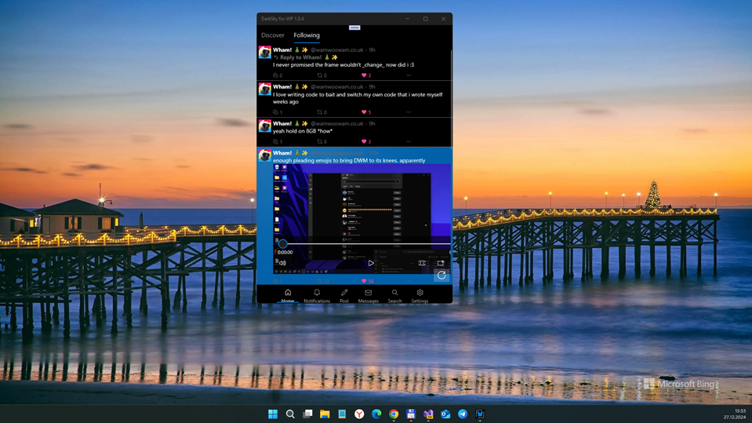

# DarkSky v1 (Alpha Preview) - retro branch

My RnD of DarkSky, modern uwp app for BlueSky social network.  The goal is to simplify this project to run/support some WindowsPhones... ;)
 
## About (words of the author)
"
DarkSky is a modern (WIP) Fluent Design UWP BlueSky client. The old app from last year is being split into a frontend and backend. This repository contains the frontend app.

For DarkSky progress discussions see: https://discord.gg/windows-apps-hub-714581497222398064

Or here: https://bsky.app/profile/firecube.bsky.social

Backend API repo: https://github.com/FireCubeStudios/DarkSky.API/
"
 - FireCubeStudios

## Screenshots

## Tech/dev details
- Platforms: UWP only
- Targets: x64; x64; ARM
- OSes: Windows 10 or Windows 10 Mobile (!)
- Win. SDK used: 19041 
- Min. Win. OS build: 15063 

## Status / my 2 cents
- Micro-research of scr code
- win sdk 22000 -> 15063 (Hello, W10M!)
- Draft. Prototype / Pre-Pre-Pre-Alpha version. Still exploring modern-ui & mvvm "magic"...
- some experiments with Darksky+BlueWP mixing , so BlueWP Core (W10M-compatible ATProto & some W10M UI) used at now :)

## References
- https://github.com/FireCubeStudios/DarkSky/ Original DarkSky project
- https://github.com/FireCubeStudios/ FireCubeStudios, DarkSky's creators/dev team 
- https://github.com/Gargaj/ Gargaj aka "Polyurethane audio breeder / semi-organic code regurgitation trooper" :)
- https://github.com/Gargaj/BlueWP "Bluesky client for Windows Phone"

## Licensing
MIT License

## ..
AS IS. No support. RnD only / DIY

## .
[m][e] November 2024

